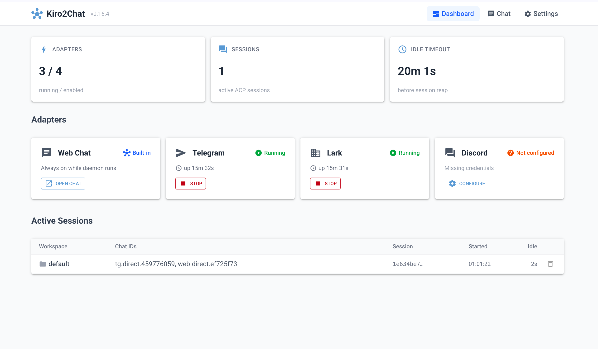
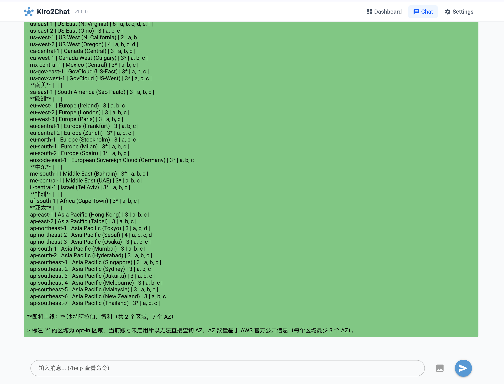
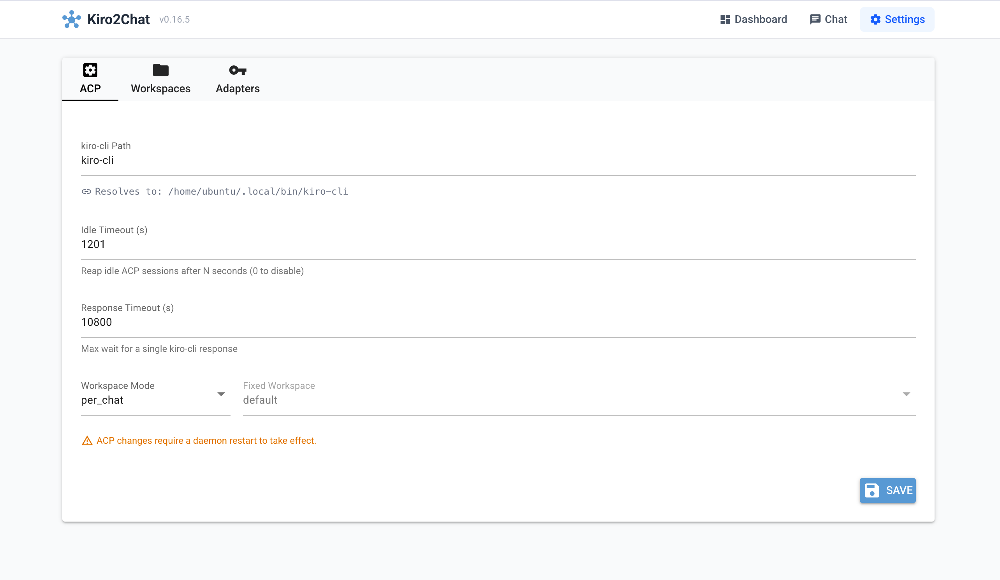
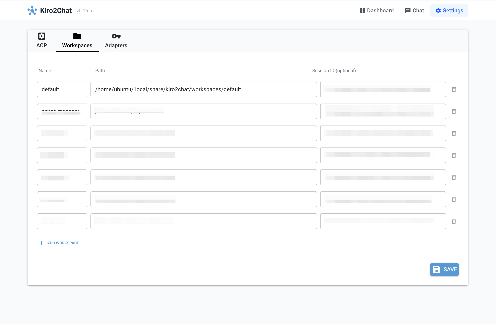
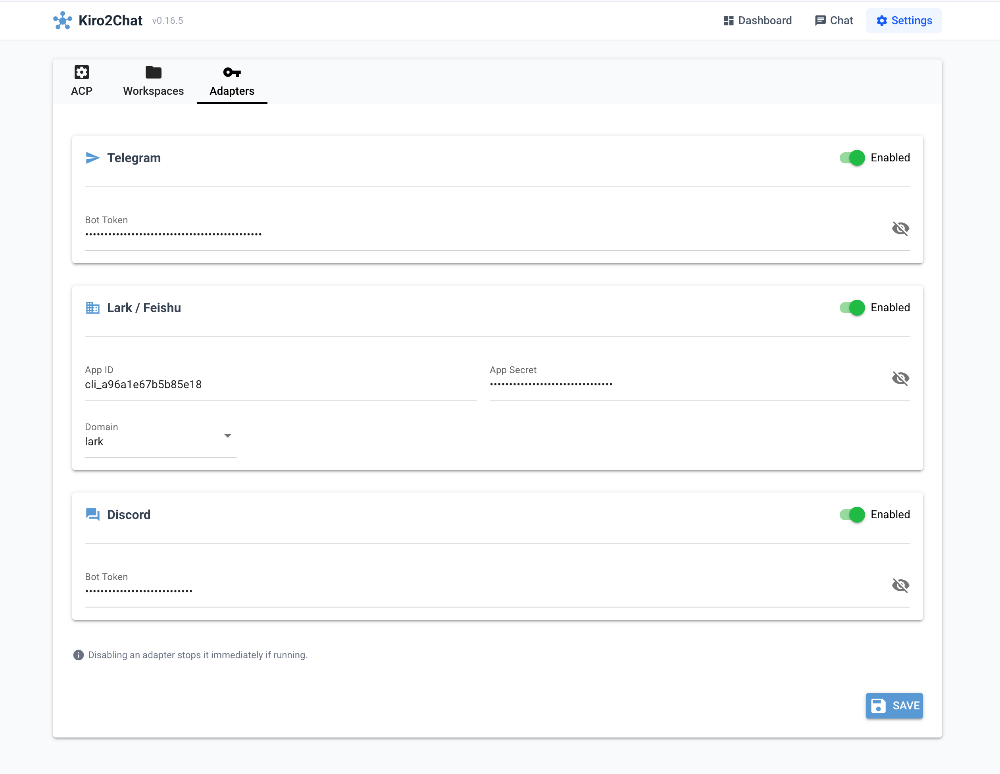

# Kiro2Chat


**[English](README.md)** | **[中文](README_CN.md)**

通过 ACP 协议将 kiro-cli 桥接到各类聊天平台（Telegram、飞书、Discord、Web）。

## 功能

- 🔗 **ACP 协议** — 通过 JSON-RPC 2.0 over stdio 与 kiro-cli 通信
- 🌐 **Web Chat** — 浏览器聊天界面：流式输出、内嵌权限卡片、消息历史、图片缩略图点击放大
- 📱 **Telegram Bot** — 流式输出、工具调用展示、内嵌键盘权限审批、图片收发
- 💬 **飞书 Bot** — 话题 session 映射、@bot 触发、图片收发、飞书/Lark 域名切换
- 🎮 **Discord Bot** — @bot 触发、图片收发、2000 字符自动分段
- 🖥 **Admin Dashboard** — NiceGUI 管理面板，adapter 启停、实时 session 统计、tab 式 Settings（ACP / Workspaces / Adapters）
- 🔁 **跨平台会话共享** — 同一 workspace 下 TG/飞书/Discord/Web 共用一个 kiro session
- 🔀 **多 workspace** — `per_chat`（用户用 `/workspace` 自选）或 `fixed`（所有聊天固定一个）
- 🔐 **权限审批** — Telegram 内嵌按钮、Web 内嵌卡片，或文本 y/n/t 兜底
- 🤖 **Agent / 模型切换** — 所有 adapter 均支持 `/agent` 和 `/model` 命令
- ⚡ **按需启动** — 收到消息才启动 kiro-cli，空闲 session 自动回收
- 🖼️ **图片支持** — 发送图片进行视觉分析（JPEG、PNG、GIF、WebP），缩略图点击放大
- 🧰 **Adapter 启用/禁用** — Dashboard 可开关每个 bot，凭证不丢失
- 🛑 **取消 & 重置** — `/cancel` 中断当前操作，`/reset` 重置会话

## 截图

**管理面板** — Adapter 状态、实时 session 统计、快捷启停



**Web Chat** — 流式输出、内嵌权限卡片、图片点击放大



**设置页** — Tab 式配置（ACP / Workspaces / Adapters），分区保存

 


**Telegram Bot** — 工具调用、内嵌按钮权限审批、Markdown 渲染

 

## 架构

```
    ┌───────────┐ ┌─────────┐ ┌─────────┐ ┌─────────┐
    │  Telegram │ │  Lark/  │ │ Discord │ │   Web   │
    │  Adapter  │ │ Feishu  │ │ Adapter │ │  Chat   │
    └─────┬─────┘ └────┬────┘ └────┬────┘ └────┬────┘
          └────────────┴──────┬────┴───────────┘
                    ┌─────────┴─────────┐
                    │      Bridge       │  会话管理、权限路由
                    └─────────┬─────────┘
                    ┌─────────┴─────────┐
                    │     ACPClient     │  JSON-RPC 2.0 over stdio
                    └─────────┬─────────┘
                    ┌─────────┴─────────┐
                    │     kiro-cli      │  acp 子进程
                    └───────────────────┘
```

## 快速开始

```bash
# 前置条件：kiro-cli 已安装并登录
git clone https://github.com/aleck31/Kiro2Chat.git
cd Kiro2Chat
uv sync

# 前台运行
uv run kiro2chat start

# 或部署为 systemd 服务
deploy/install.sh             # 自动检测路径，安装并启用
kiro2chat start               # 启动
kiro2chat stop                # 停止
kiro2chat status              # 查看状态
```

打开 `http://127.0.0.1:7860` 进入管理面板，在 `/settings` 页面配置 Token。

## 命令

所有 adapter 均支持以下命令：

| 命令 | 说明 |
|------|------|
| `/model` | 查看/切换模型 |
| `/agent` | 查看/切换 Agent |
| `/workspace` | 查看当前 workspace |
| `/workspace list` | 列出所有 workspace |
| `/workspace switch <name>` | 切换 workspace |
| `/context` | 查看上下文使用率 |
| `/cancel` | 取消当前操作 |
| `/reset` | 重置会话 |
| `/help` | 帮助 |

> Discord 和飞书：群聊中 @bot 触发，私聊直接对话。

## 配置

所有配置通过 `~/.config/kiro2chat/config.toml` 管理，也可通过 Web 管理面板 `/settings` 页面修改。

```toml
[telegram]
tg_bot_token = "your-token"
tg_enabled = true                   # 关闭后保留凭证但不 auto-start

[lark]
lark_app_id = "cli_xxx"
lark_app_secret = "xxx"
lark_domain = "feishu"              # feishu | lark
lark_enabled = true

[discord]
discord_bot_token = "your-token"
discord_enabled = true

[web]
web_host = "127.0.0.1"
web_port = 7860

[acp]
kiro_cli_path = "kiro-cli"
workspace_mode = "per_chat"         # per_chat | fixed
fixed_workspace = "default"         # 仅 workspace_mode = "fixed" 时生效
idle_timeout = 1200                 # 空闲 session 回收时间（秒），0 禁用
response_timeout = 3600             # 单次 prompt 最大等待

[workspaces.default]
path = "~/.local/share/kiro2chat/workspaces/default"
# session_id = "..."                # kiro2chat 自动维护，不要手动改

[workspaces.my-project]
path = "~/repos/my-project"
```

### 会话共享

Session 按 **workspace** 作为 key，不是按 chat_id。TG / 飞书 / Discord / Web
只要指向同一个 workspace，就会复用同一个 kiro session —— 实现跨平台上下文一致。
每条消息会被 prepend `[platform/user]` 让 kiro 区分来源。

## 项目结构

```
src/
├── app.py              # 入口、CLI
├── config.py           # 配置（dataclass + field_factory，支持 reload）
├── config_manager.py   # TOML 配置读写
├── log_context.py      # 日志上下文
├── manager.py          # Adapter 生命周期管理
├── server.py           # WebServer — 承载 NiceGUI，装配页面，启动 manager
├── acp/
│   ├── client.py       # ACP JSON-RPC 客户端
│   └── bridge.py       # 按 workspace 共享 session、权限路由
├── adapters/
│   ├── base.py         # Adapter 接口 + 共享命令 dispatcher
│   ├── telegram.py     # Telegram Adapter (aiogram)
│   ├── lark.py         # 飞书 Adapter (lark-oapi WebSocket)
│   ├── discord.py      # Discord Adapter (discord.py)
│   └── web.py          # Web Chat Adapter — 收发消息、权限卡片
└── webui/
    ├── layout.py       # 统一顶部导航
    ├── dashboard.py    # / — adapter 状态、session、实时统计
    ├── settings.py     # /settings — tab 式配置（ACP / Workspaces / Adapters）
    └── chat.py         # /chat — 聊天页面 + 渲染 helpers
```

## 技术栈

| 组件 | 技术 |
|------|------|
| ACP 传输 | JSON-RPC 2.0 over stdio |
| Web UI (Chat + Admin) | NiceGUI |
| Telegram Bot | aiogram 3 |
| 飞书 Bot | lark-oapi (WebSocket) |
| Discord Bot | discord.py 2 |
| 配置 | TOML (config.toml) |
| 包管理 | uv + hatchling |
| Python | ≥ 3.13 |

## 相关项目

- [open-kiro](https://github.com/aleck31/open-kiro) — Kiro 的 OpenAI 兼容 API 网关

## 许可证

MIT
